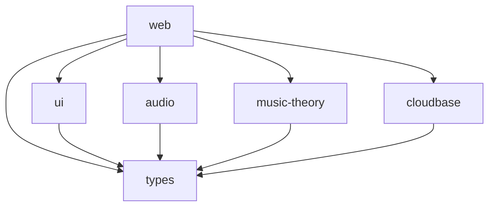

# 🎸 Little Guitar Monorepo

吉他学习应用 Monorepo 项目，基于 React + Vite + TypeScript 构建，采用 pnpm workspace 管理。

## 访问地址

**线上地址**: [https://littleguitar.pages.dev/#/blues](https://littleguitar.pages.dev/#/blues)


---

## 🏗️ 项目架构

这是一个 monorepo 项目，包含以下子包：

```
little-guitar-monorepo/
├── packages/
│   ├── apps/
│   │   └── web/                    # 主 Web 应用 (React + Vite)
│   └── packages/
│       ├── ui/                     # 共享 UI 组件库
│       ├── audio/                  # 音频处理工具库 (调音器��鼓机)
│       ├── music-theory/           # 音乐理论工具库 (音阶、和弦、指板)
│       ├── cloudbase/              # 云开发 SDK 封装
│       └── types/                  # 共享 TypeScript 类型定义
└── packages/cloudfunctions/        # 云函数集合
```

### 子包说明

- **@little-guitar/web** - 主 Web 应用，包含完整的吉他学习功能
- **@little-guitar/ui** - 可复用的 React 组件库
- **@little-guitar/audio** - 音频处理工具，包含调音器和鼓音生成器
- **@little-guitar/music-theory** - 音乐理论工具，包含音阶、和弦计算等
- **@little-guitar/cloudbase** - 腾讯云开发 SDK 封装
- **@little-guitar/types** - 项目共享的 TypeScript 类型定义
- **云函数** - 后端云函数集合

## ✨ 功能特点

### 🎹 Blues 即兴练习

全功能的Blues练习系统，包含完整的虚拟乐队伴奏：

#### 🎼 音阶练习
- **三种Blues音阶**：小调Blues、大调Blues、Mixolydian
- **12个调式选择**：支持所有大调和半音调
- **可视化指板**：实时显示音阶位置，根音高亮
- **音符标注**：清晰显示每个音符在指板上的位置

#### 🎹 和弦进行练习
- **标准12小节Blues进行**：经典I-IV-V进行
- **快速6小节进行**：适合快速练习
- **实时和弦显示**：当前演奏和弦高亮提示
- **BPM速度控制**：
  - 滑动条调节（60-180 BPM）
  - 6个快捷按钮（60/80/100/120/140/160）
  - 实时节拍指示器
  - 速度描述提示（慢速/中速/快速/极速）

#### 🥁 鼓声节奏
- **三种节奏型**：
  - Shuffle：Blues摇摆节奏
  - Standard：标准四四拍
  - Slow Blues：慢板Blues
- **音量独立控制**：0-100%可调
- **实时拍号显示**：4拍可视化指示器

#### 🎺 Blues 伴奏系统
- **🎵 口琴伴奏**：
  - 模拟真实口琴音色（多振荡器合成 + LFO颤音）
  - 在强拍（1、3拍）演奏Blues Riff
  - 独立音量控制
- **🎸 吉他伴奏**：
  - Karplus-Strong算法模拟拨弦音色
  - 跟随和弦进行自动演奏
  - 支持扫弦和闷音效果
  - 自动生成属七和弦
  - 独立音量控制

#### 🎵 节奏训练
- 多种Blues节奏型练习
- 节拍器功能
- BPM可调节

#### ✨ 即兴创作
- 综合实战练习
- 音阶、和弦、节奏融合

### 🎼 和弦查找器

丰富的和弦库和指法图解：

- **常用和弦指法**：大三、小三、七和弦等多种类型
- **交互式指板显示**：清晰的可视化指法图
- **多维度筛选**：按和弦类型和根音快速查找
- **替代指法支持**：提供多种演奏选择

### 🎵 吉他调音器

精准的实时调音工具，帮助你快速调好吉他：

- **实时音频分析**：使用Web Audio API + FFT算法精确检测音高
- **标准调音支持**：支持6根弦标准调音 (E2, A2, D3, G3, B3, E4)
- **可视化反馈**：
  - 实时频率显示
  - 音分偏差指示器（±50音分范围）
  - 颜色编码精度提示（绿色=完美，黄色=接近，红色=偏离）
- **智能识别**：自动识别最接近的音符并显示调整方向
- **历史数据追踪**：记录调音过程，便于分析


## 🛠️ 技术栈

### Monorepo 管理
- **包管理器**: pnpm workspace
- **构建工具**: Turbo
- **版本管理**: Changesets

### 前端技术
- **前端框架**: React 19 + TypeScript
- **构建工具**: Vite
- **路由**: React Router 6（HashRouter）
- **样式**: Tailwind CSS + DaisyUI
- **动画**: Framer Motion

### 音频技术
- **Web Audio API**：实时音频处理和分析
- **FFT算法**：频域分析和音高检测
- **HPS算法**：谐波乘积谱精确检测基频
- **音频合成**：
  - 振荡器（Oscillator）
  - 增益控制（Gain）
  - 滤波器（BiquadFilter）
  - LFO（低频振荡器）


### 云开发技术
- **云开发**: 腾讯云开发 CloudBase
- **SDK**: @cloudbase/js-sdk
- **部署**: 静态托管 + 云函数

---

## 🚀 快速开始

### 环境要求
- Node.js >= 18
- pnpm >= 8

### 安装依赖
```bash
pnpm install
```

### 开发模式
```bash
# 启动主 Web 应用
pnpm dev

# 或者使用 workspace
pnpm -C packages/apps/web dev
```

### 构建
```bash
# 构建所有包
pnpm build:all

# 构建主应用
pnpm build
```

### 代码检查
```bash
# 所有包的代码检查
pnpm lint

# 类型检查
pnpm type-check
```

## 📦 部署

### Web 应用部署
```bash
# 构建并部署 Web 应用
pnpm deploy:web
```

### 云函数部署
```bash
# 部署所有云函数
pnpm deploy:functions

# 部署全部资源
pnpm deploy:all
```

### 传统部署方式
```bash
# 1. 构建项目
pnpm build

# 2. 部署到云开发静态托管
npx @cloudbase/cli hosting:deploy ./packages/apps/web/dist -e cloud1-8g1pwz868e1c211b
```

### 云开发资源信息

- **线上地址**: https://cloud1-8g1pwz868e1c211b-1302374225.tcloudbaseapp.com/guitar-app
- **环境ID**: `cloud1-8g1pwz868e1c211b`
- **静态托管**: packages/apps/web/dist
- **云函数目录**: packages/cloudfunctions

## 🛠️ 开发指南

### 添加新的共享组件
1. 在 `packages/packages/ui/src` 中创建组件
2. 在 `packages/packages/ui/src/index.ts` 中导出
3. 在需要的应用中导入使用

### 添加新的工具函数
- 音频相关：添加到 `packages/packages/audio/src`
- 音乐理论相关：添加到 `packages/packages/music-theory/src`
- 云开发相关：添加到 `packages/packages/cloudbase/src`

### 类型定义
所有共享的类型定义都应放在 `packages/packages/types/src` 中。

## 📊 包���赖关系



## 📁 项目结构

```
little-guitar/
├── public/                      # 静态资源
├── src/
│   ├── components/              # 可复用组件
│   │   ├── ChordPractice/       # 和弦进行练习组件
│   │   ├── ScalePractice/       # 音阶练习组件
│   │   ├── RhythmPractice/      # 节奏训练组件
│   │   ├── Improvisation/       # 即兴创作组件
│   │   ├── Navbar.jsx           # 导航栏
│   │   └── Footer.jsx           # 页脚
│   ├── pages/                   # 页面组件
│   │   ├── HomePage.jsx         # 首页
│   │   ├── TunerPage.jsx        # 调音器页面
│   │   ├── BluesPage.jsx        # Blues练习页面
│   │   └── ChordFinderPage.jsx  # 和弦查找器页面
│   ├── utils/                   # 工具类
│   │   ├── drumKit.js           # 鼓组音频合成
│   │   └── accompaniment.js     # 伴奏音频合成（口琴/吉他）
│   ├── App.jsx                  # 应用入口
│   ├── main.jsx                 # 渲染入口
│   └── index.css                # 全局样式
├── index.html                   # HTML 模板
├── tailwind.config.js           # Tailwind 配置
├── vite.config.js               # Vite 配置
└── package.json                 # 项目依赖
```

---

## 📖 使用指南

### 🎵 调音器使用

1. 点击导航栏进入"调音器"页面
2. 点击"开始调音"按钮（浏览器会请求麦克风权限）
3. 选择要调的弦（1-6弦）
4. 弹奏对应的弦，观察：
   - **频率显示**：当前检测到的频率
   - **音符显示**：最接近的音符
   - **指针位置**：偏左=音低，偏右=音高，居中=准确
   - **颜色提示**：绿色=完美，黄色=接近，红色=需调整
5. 根据指示调整琴弦松紧，直到指针居中且显示绿色

### 🎹 Blues 练习使用

1. 进入"Blues 即兴"页面
2. 选择练习模式：
   - **和弦进行**：练习Blues和弦变化
   - **音阶练习**：学习Blues音阶位置
   - **节奏训练**：培养节奏感
   - **即兴创作**：综合实战

#### 和弦进行练习步骤：
1. 选择调式（A、C、E、G等）
2. 选择进行类型（12小节/6小节）
3. 调整BPM速度（建议初学者从60-80开始）
4. 配置伴奏：
   - 开启鼓声，选择节奏型
   - 可选：开启口琴伴奏
   - 可选：开启吉他伴奏
5. 点击"播放"开始练习
6. 跟随高亮的和弦提示演奏

### 🎼 和弦查找器使用

1. 进入"和弦查找"页面
2. 选择根音（C、D、E等）
3. 选择和弦类型（大三、小三、七和弦等）
4. 查看指法图：
   - 黑点表示按弦位置
   - 数字表示使用的手指
   - X表示不弹该弦
   - O表示空弦
5. 查看和弦组成音信息

---

## 🎯 技术亮点

### 音频处理
- **零延迟音频分析**：使用`requestAnimationFrame`实现实时处理
- **高精度频率检测**：32768点FFT + HPS算法
- **纯前端音频合成**：无需音频文件，使用Web Audio API动态生成

### 性能优化
- **React Hooks优化**：使用`useCallback`、`useRef`避免不必要渲染
- **音频节点复用**：减少内存占用
- **异步处理**：音频处理不阻塞UI

### 用户体验
- **响应式设计**：完美适配桌面和移动设备
- **流畅动画**：Framer Motion提供丝滑的交互体验
- **即时反馈**：所有操作都有清晰的视觉和听觉反馈

---

